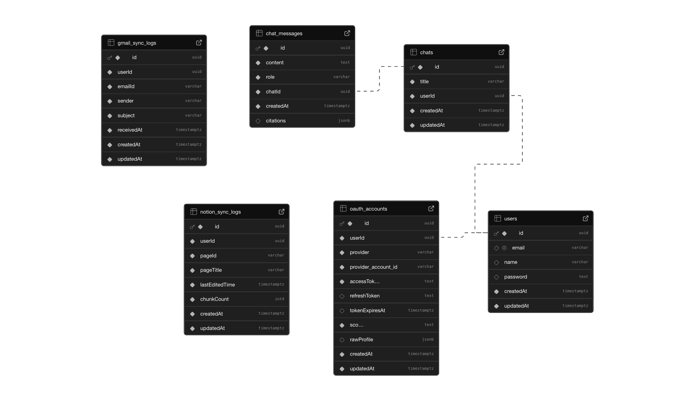

# Velyx

An AI chat application that connects to your Notion, Gmail, and HubSpot accounts, allowing you to search and query your data using natural language.


## Features

- Chat interface with AI-powered responses
- Connect and search your Notion workspace
- Connect and search your Gmail inbox
- Connect and search your HubSpot contacts
- Real-time streaming responses
- Conversation history

## Tech Stack

**Frontend:** React, TypeScript, Vite, Socket.IO, Redux Toolkit

**Backend:** Node.js, Express, TypeScript, LangChain, LangGraph, OpenAI, Socket.IO, TypeORM

**Database:** PostgreSQL, Milvus (vector database)


## Architecture


## Database Schema Diagram




## Setup

### Prerequisites

- Node.js (v18 or higher)
- PostgreSQL database
- Milvus/Zilliz account
- API keys for OpenAI, Google, Notion, and HubSpot

### Backend

```bash
cd backend
npm install
cp .env.example .env
# Fill in your environment variables in .env
npm run dev
```

### Frontend

```bash
cd frontend
npm install
cp .env.example .env
# Fill in your environment variables in .env
npm run dev
```

## Environment Variables

See `.env.example` files in both `backend/` and `frontend/` directories for required configuration.

## Project Structure

```
backend/
  agents/         - LangGraph agent and Langchain tools
  controllers/    - Route handlers
  entities/       - Database models
  routes/         - API routes
  data/           - Data sync pipelines

frontend/
  src/
    api/          - API client functions
    components/   - React components
    pages/        - Page components
    services/     - Socket service
    store/        - Redux slices and store
```

## Usage

1. Sign up or log in
2. Connect your accounts (Notion, Gmail, HubSpot) from the dashboard
3. Start chatting and ask questions about your connected data
